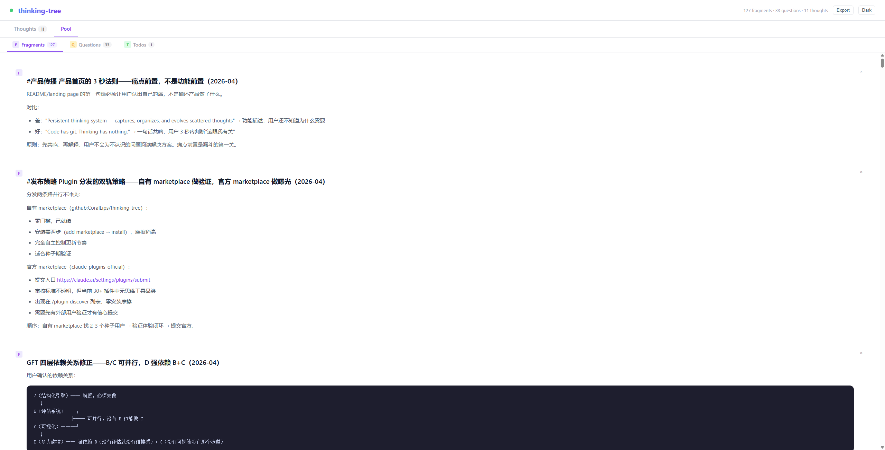
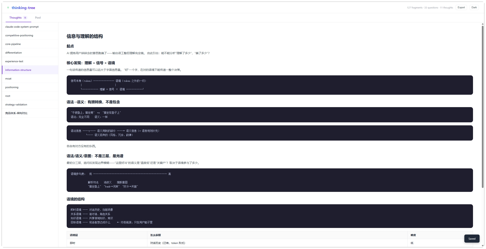

[English](README.md) | [中文](README.zh-CN.md)

# thinking-tree

Code has git. Thinking has nothing.

AI makes it worse — you produce 5x more insights per session, but still save zero. The best ideas vanish when the conversation ends. thinking-tree is a Claude Code plugin that catches them before they do.

**Fragments accumulate as you work:**



**Crystallize into structured thoughts over time:**



## Install

In your Claude Code terminal:

```bash
# 1. Add the marketplace (one-time)
/plugin marketplace add github:CoralLips/thinking-tree

# 2. Install the plugin
/plugin install thinking-tree

# 3. Enable recording
/think
```

That's it. Work normally — thinking-tree evaluates each conversation turn and saves insights worth keeping.

## How it works

1. **You work normally** — code, discuss, debug
2. **AI evaluates each turn** — is there an independent insight here?
3. **Worth recording → saved** as a fragment or question in `~/.thinking-tree/`
4. **Next session** — recent fragments and open questions are injected as context
5. **Review anytime** — web viewer at `http://localhost:3456`

Every turn ends with a status line:
- `📝 Title` — fragment or question recorded
- `🌳` — checked, nothing to record

## Spaces

```
~/.thinking-tree/
├── *.md            Thoughts — crystallized understanding with a throughline
├── fragments.md    Fragments — standalone insights, not yet organized
├── questions.md    Questions — specific unknowns with direction
└── todos.md        Todos — actionable items derived from thinking
```

Fragments accumulate → organize into thought files → questions emerge → answers flow back.

## Commands

| Command | What it does |
|---------|-------------|
| `/think` | Toggle recording on/off (takes effect immediately) |
| `/reduce` | Interactive cleanup — deduplicate, classify, remove stale fragments |
| `/catch` | Manually capture missed insights — accepts a hint about what to look for |
| `/pref` | Adjust recording preferences via natural language |

## Web Viewer

Auto-starts at [localhost:3456](http://localhost:3456) when you begin a session.

- Browse thoughts, fragments, questions, todos
- Click to edit, Ctrl+S to save
- Real-time sync — edits in Claude or the viewer appear instantly
- Dark/light theme, export as markdown

## Update

Plugin updates require two steps (this is a Claude Code limitation):

```bash
# 1. Refresh the marketplace catalog
/plugin marketplace update CoralLips

# 2. Update the plugin
/plugin update thinking-tree
```

## Data

All data lives in `~/.thinking-tree/`. The plugin never touches your project files. Uninstalling the plugin leaves your data intact.

## License

MIT
